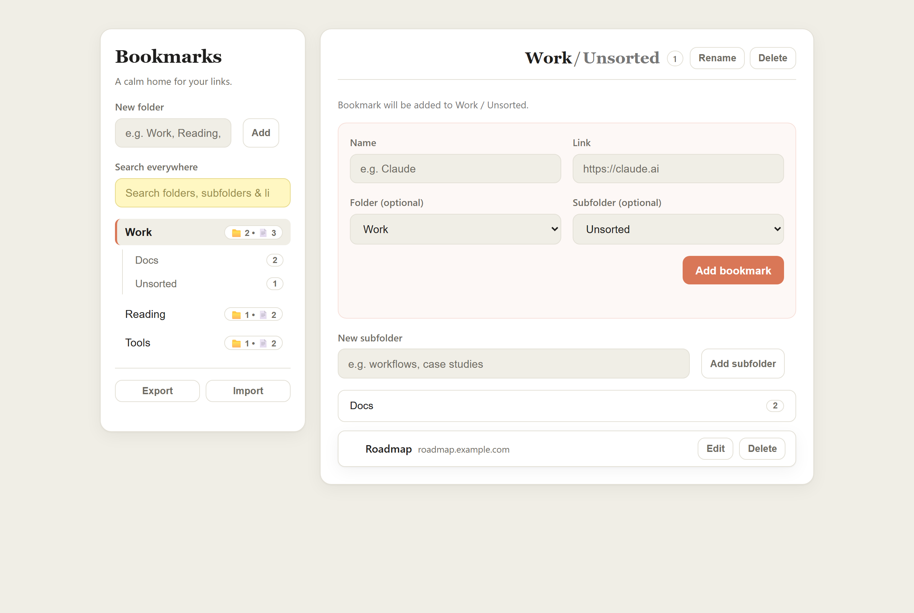
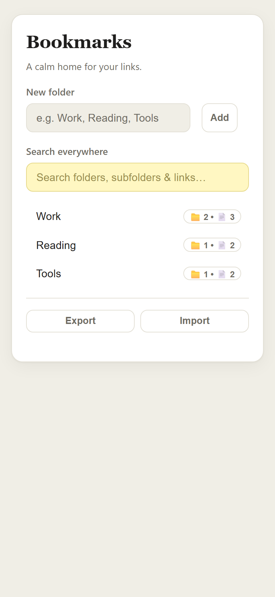

# Bookmarks — a calm bookmark manager

A small, dependency-free bookmark manager that keeps links tidy without getting in the way. Organise links into **folders → subfolders**, search across everything instantly, and file new links exactly where they belong — or leave them unsorted and tidy up later.

Built with plain **HTML, CSS, and JavaScript** (no framework, no build step). Data is saved in the browser's `localStorage`, so it works entirely offline and needs no server.

> **Live demo:** https://evabecvarova.github.io/bookmark-app/

---

<p align="center">
  
</p>
<p align="center">
  
</p>

---

## Highlights

- **Two-level organisation** — Folder → Subfolder → Bookmark, deliberately capped at one level of nesting so it never becomes a maze.
- **GLOBAL + Unsorted, by design** — new links can be dropped in without a decision: they land in an auto-generated **Unsorted** bucket (per folder, or a top-level **GLOBAL / Unsorted**) and can be filed later. Nothing is ever lost.
- **File-on-create, optionally** — the "Add bookmark" form has optional Folder/Subfolder pickers that default to wherever you are, so the common case is one step, and filing elsewhere is still one step.
- **Instant global search** — searches folder names, subfolder names, link names, and URLs at once, with matched text highlighted and a `Folder / Subfolder` tag on every result.
- **Always-visible breadcrumb** — you always know where you are: `GLOBAL / Unsorted`, `Folder / Unsorted`, `Folder / Subfolder`, or `Search results`.
- **Responsive** — a two-pane layout on desktop that collapses to a single pane with a back button on mobile.
- **Calm, accessible UI** — a warm, low-contrast theme with clear focus states, no alarming colours, and keyboard-operable controls.

## Features

- Create, rename, and delete folders and subfolders
- Add, edit, and delete bookmarks; move a bookmark between folders/subfolders while editing
- Deleting a folder or subfolder keeps what's inside (bookmarks move up to **Unsorted** / **GLOBAL**) — no accidental data loss
- **Export/Import as JSON** — back up everything to a file, or carry it to a different browser or hosting location. Import is merge-safe (matched by id), so importing the same file more than once never creates duplicates
- Favicons fetched per link for quick visual scanning
- All data persists locally between sessions

## Tech notes

- **No dependencies / no build** — open `index.html` and it runs.
- **Backward-compatible data model** — bookmarks are stored as a flat list keyed by `categoryId` and an optional `subfolderId`. A missing `subfolderId` simply means "Unsorted", so the data format could grow (folders → subfolders → GLOBAL) without migrating or losing anything already saved.
- **Safe rendering** — all user-entered text (names, URLs, search highlights) is inserted via `textContent`/DOM nodes rather than `innerHTML`, so bookmark data can't inject markup.
- **Storage is per-origin, not per-file** — `localStorage` is scoped to the exact URL a page is opened from. Two consequences worth knowing: (1) opening `index.html` via a `file://` path scopes data to that *exact folder path* — moving or renaming the folder means the next open starts empty (the old data isn't gone, just stranded under the old path); (2) the local file and the [hosted version](https://evabecvarova.github.io/bookmark-app/) are different origins with entirely separate data — they never sync automatically. Export/Import is the bridge between any two of these.

## Running it locally

It's a static site — no install required.

```bash
# clone, then simply open the file:
open index.html        # macOS
start index.html       # Windows
```

Or serve it with any static server if you prefer a `http://` origin:

```bash
npx serve .
```

## Project structure

```
bookmark-app/
├── index.html   # markup: sidebar (folders + search) and content pane
├── style.css    # theme tokens, two-pane layout, components
├── script.js    # state, rendering, and all interactions
└── docs/        # README screenshots
```

## Possible next steps

- Import from browser bookmarks (Chrome/Firefox export format)
- Drag-and-drop to reorder and re-file links
- Optional cloud sync

---

Built by [Eva Bečvářová](https://github.com/evabecvarova) as a portfolio project.
